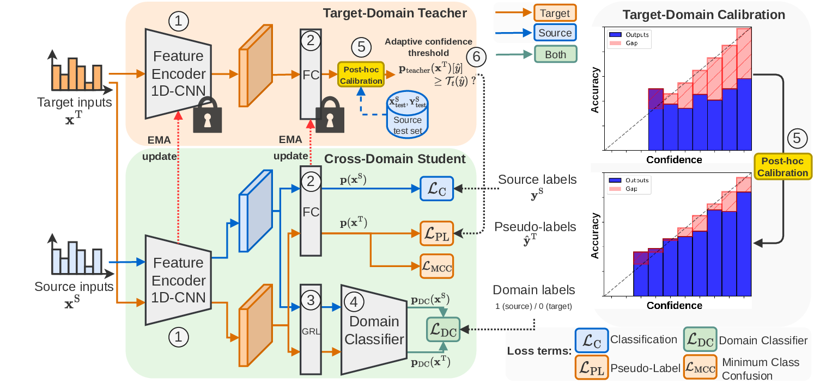

<div align='center'>

# Calibrated Adaptive Teacher for Domain Adaptive Intelligent Fault Diagnosis

[Florent Forest](https://florentfo.rest)<sup>1</sup>&nbsp;&nbsp;&nbsp;
[Olga Fink](https://people.epfl.ch/olga.fink)<sup>1</sup>
<br/>
<sub>
<sup>1</sup> Intelligent Maintenance and Operations Systems (IMOS), EPFL, Lausanne, Switzerland
</sub>

Sensors, 2024

[](https://www.mdpi.com/1424-8220/24/23/7539)&nbsp;&nbsp;&nbsp;[](https://arxiv.org/abs/2312.02826)

</div>

Source code for the implementation of the paper [Calibrated Adaptive Teacher for Domain Adaptive Intelligent Fault Diagnosis](https://www.mdpi.com/1424-8220/24/23/7539).

In this paper, we propose a novel unsupervised domain adaptation method called Calibrated Adaptive Teacher (CAT), where we propose to calibrate the predictions of the teacher network on target samples throughout the self-training process, leveraging post hoc-calibration techniques.

<div align='center'>
<br/>
<span style="color: #777">Our proposed Calibrated Adaptive Teacher (CAT). The main novelty involves a post-hoc calibration of the teacher predictions in the target domain throughout the self-training process, improving the quality of pseudo-labels.</span>
</div>

## Requirements

- numpy
- tqdm
- sklearn
- scipy
- pytorch
- torchvision
- tensorboard

## Basic usage

To train source-only models:

```shell
python train_base.py --help
```

To train single-model DA baselines:

```shell
python train_advanced.py --help
```

To train teacher-student models, including CAT:

```shell
python train_advanced_ts.py --help
```

In particular, to train the best-performaing CAT-TempScaling model on the Paderborn bearing dataset, the command is:

```shell
python train_advanced_ts.py \
  --data_name PU \
  --transfer_task "[[0],[1]]" \
  --data_dir /path/to/dataset \
  --domain_adversarial True \
  --adversarial_loss DA \
  --self_training True \
  --self_training_criterion confidence \
  --adaptive_confidence_threshold \
  --calibration TempScaling \
  --mcc_loss --sdat \
  --checkpoint_dir output/cat_tempscaling_output
```

## Project structure

```
CAT/
├── datasets/: dataset loading classes
├── loss/: loss functions
├── models/: models
├── optim/: SAM optimizer
├── transcal/: confidence calibration techniques
├── utils/
    ├── calibration.py: ECE metric calculations
    ├── entropy_CDA.py: entropy-weighted CDAN loss
    ├── logger.py: base logger
    ├── mixup.py: mix-up techniques (not used in paper)
    ├── self_training.py: self-training strategies (pseudo-labeling)
    ├── train_utils_base.py: training loop for source-only models
    ├── train_utils_combines.py: training loop for single-model DA baselines
    └── train_utils_combines_ts.py: training loop for teacher-student DA models
├── train_advanced_ts.py: main script for training teacher-student models
├── train_advanced.py: main script for training single-model DA baselines
├── train_base.py: main script for training source-only models
└── train_net.py: main script for training and evaluation
```

## Datasets

The following datasets are supported:

- **[CWRU Bearing Dataset](https://csegroups.case.edu/bearingdatacenter/pages/download-data-file/)**
- **[PU Bearing Dataset](https://mb.uni-paderborn.de/kat/forschung/datacenter/bearing-datacenter/)**
- **[PHM 2009](https://www.phmsociety.org/competition/PHM/09/apparatus)**
- **[SEU Gearbox Dataset](https://github.com/cathysiyu/Mechanical-datasets)**
- **[JNU Bearing Dataset](http://mad-net.org:8765/explore.html?t=0.5831516555847212.)**

## Citation

If this work was useful to you, please cite our paper:

```BibTeX
@article{forest_calibrated_2024,
    title = {Calibrated Adaptive Teacher for Domain Adaptive Intelligent Fault Diagnosis},
    author = {Forest, Florent and Fink, Olga},
    journal = {Sensors},
    year = {2024},
    volume = {24},
    number = {23},
    url = {https://www.mdpi.com/1424-8220/24/23/7539},
    doi = {10.3390/s24237539}
}
```

## Acknowledgements

The code for this work is based on following repositories:

* [UDTL](https://github.com/ZhaoZhibin/UDTL/)&nbsp;&nbsp;&nbsp;
* [TransCal](https://github.com/thuml/TransCal)&nbsp;&nbsp;&nbsp;
* [SAM](https://github.com/davda54/sam)&nbsp;&nbsp;&nbsp;


We would like to thank their original authors!
